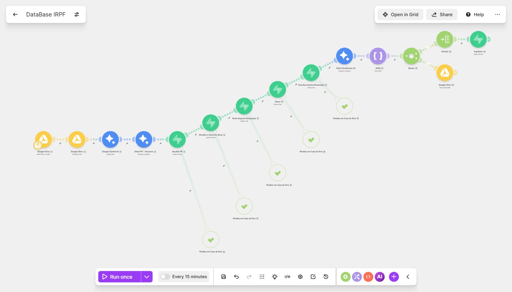
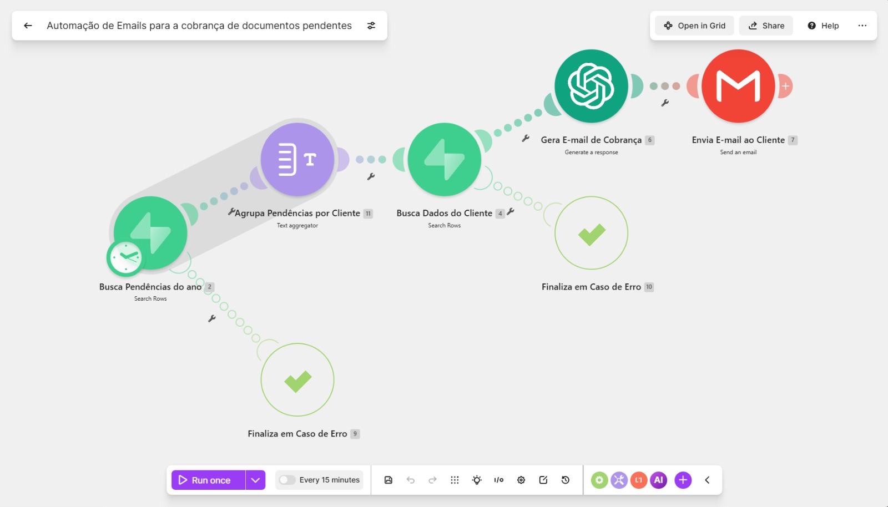

# Automação de IRPF com Make, Supabase e Inteligência Artificial

Projeto de automação para processamento de declarações de Imposto de Renda Pessoa Física, organização de documentos, identificação de pendências e envio automático de solicitações por e-mail.

A solução é composta por duas automações tecnicamente independentes, mas que trabalham de forma integrada por meio de um banco PostgreSQL hospedado no Supabase.

> Este repositório contém versões demonstrativas e sanitizadas das automações. Nenhuma credencial, chave de API ou informação real de cliente está incluída.

---

## Visão geral

O projeto automatiza parte do processo de coleta e conferência de documentos relacionados ao IRPF.

A primeira automação recebe uma declaração, utiliza inteligência artificial para extrair informações, registra os dados no Supabase e identifica documentos que ainda precisam ser solicitados.

A segunda automação consulta os documentos pendentes, agrupa as solicitações por cliente, gera um e-mail personalizado com inteligência artificial e realiza o envio automático.

### Fluxo completo

```mermaid
flowchart LR
    A[Google Drive] --> B[Make - Processamento de declaração]
    B --> C[Gemini AI]
    C --> D[Supabase PostgreSQL]

    D --> E[Pessoas]
    D --> F[Exercícios]
    D --> G[Documentos]
    D --> H[Pendências]
    D --> I[Uploads]

    H --> J[View de documentos pendentes]
    J --> K[Make - Cobrança automática]
    K --> L[OpenAI]
    L --> M[Gmail]
    M --> N[Cliente]

## Visão das automações

### Processamento de declarações e geração de pendências



### Cobrança automática de documentos pendentes

