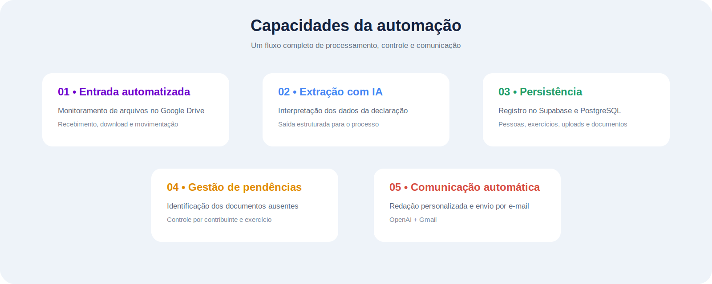
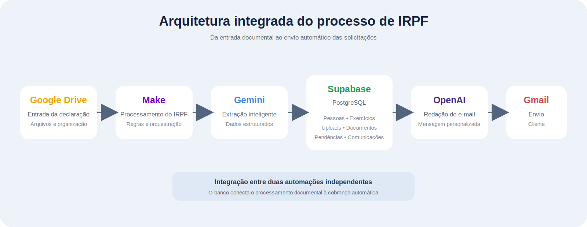
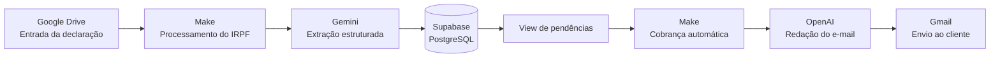
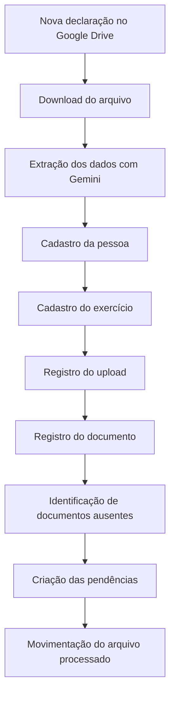
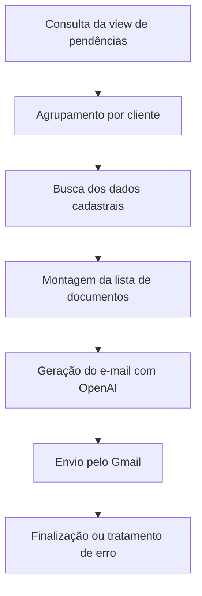
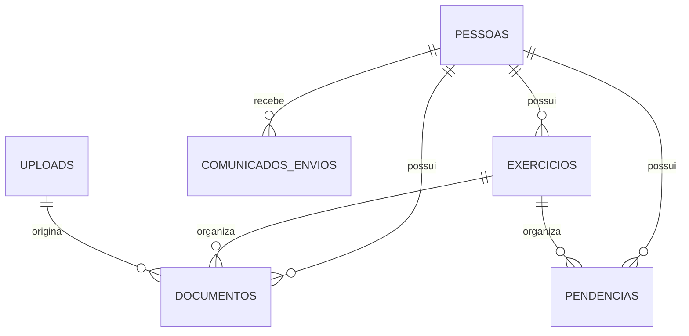

<div align="center">

# Automação de IRPF com Make, Supabase e Inteligência Artificial

### Processamento documental, gestão de pendências e comunicação automatizada


</div>

---

## Sobre o projeto

Este projeto automatiza parte do processo operacional de **Imposto de Renda Pessoa Física (IRPF)**, desde a entrada da declaração até a identificação e cobrança de documentos pendentes.

A solução utiliza **duas automações independentes**, integradas por um banco PostgreSQL hospedado no Supabase:

- **Processamento da declaração:** recebe o arquivo, extrai informações com IA, registra os dados e gera pendências.
- **Cobrança de documentos:** consulta as pendências, agrupa por cliente, redige uma mensagem personalizada e envia o e-mail.

> [!IMPORTANT]
> Este repositório contém versões demonstrativas e sanitizadas. Nenhuma credencial, chave de API, token, documento real ou informação de cliente está incluída.

---

## Capacidades da solução

<p align="center">
  
</p>

| Etapa | Entrega |
|---|---|
| Entrada documental | Monitoramento e leitura de arquivos no Google Drive |
| Extração inteligente | Identificação de informações da declaração com Gemini |
| Persistência | Registro estruturado no Supabase/PostgreSQL |
| Controle | Geração e acompanhamento de documentos pendentes |
| Comunicação | Criação de mensagens personalizadas com OpenAI |
| Envio | Disparo automático das solicitações pelo Gmail |

---

## Arquitetura da solução

<p align="center">
  
</p>



---

## Cenários no Make

### 1. Processamento de declarações e geração de pendências

<p align="center">
  
</p>

Esse cenário recebe a declaração, extrai os dados necessários, registra as informações no banco e identifica documentos que ainda precisam ser solicitados.

### 2. Cobrança automática de documentos pendentes

<p align="center">
  
</p>

Esse cenário consulta as pendências abertas, agrupa os documentos por cliente e gera uma mensagem personalizada antes do envio pelo Gmail.

---

## Automação 1 — Processamento da declaração

**Blueprint:** `Make/1-DataBase_IRPF.blueprint.json`



### Dados tratados

- identificação do contribuinte;
- CPF e dados de contato;
- exercício e ano-calendário;
- fontes pagadoras;
- rendimentos;
- bens e direitos;
- pagamentos efetuados;
- dependentes;
- documentos apresentados;
- documentos ainda pendentes.

---

## Automação 2 — Cobrança de pendências

**Blueprint:** `Make/2-Automacao_emails_pendencias_com_IA.blueprint.json`



---

## Banco de dados

**Arquivo de referência:** `Supabase/Database_postgres.sql`

> [!NOTE]
> O arquivo SQL é uma referência estrutural e pode exigir ajustes de sequências, tipos, enums, views e políticas antes da execução em um novo projeto Supabase.

| Entidade | Responsabilidade |
|---|---|
| `pessoas` | Cadastro do contribuinte |
| `exercicios` | Exercício e ano-calendário |
| `uploads` | Histórico dos arquivos recebidos |
| `documentos` | Documentos associados à pessoa e ao exercício |
| `pendencias` | Documentos faltantes e respectivo status |
| `comunicados_envios` | Histórico das comunicações |
| `irpf_perguntas_respostas` | Perguntas, respostas e aprovações |



---

## Tecnologias utilizadas

| Tecnologia | Aplicação |
|---|---|
| **Make** | Orquestração dos cenários e regras |
| **Google Drive** | Entrada e organização dos arquivos |
| **Gemini** | Extração e interpretação da declaração |
| **Supabase** | Plataforma de dados |
| **PostgreSQL** | Persistência relacional |
| **OpenAI** | Redação das mensagens de cobrança |
| **Gmail** | Envio automático dos e-mails |

---

## Estrutura do repositório

```text
.
├── .gitattributes
├── README.md
├── Make/
│   ├── 1-DataBase_IRPF.blueprint.json
│   └── 2-Automacao_emails_pendencias_com_IA.blueprint.json
├── Supabase/
│   └── Database_postgres.sql
└── images/
    ├── 1-fluxo_processamento_irpf.jpeg
    ├── 2-fluxo_cobranca_pendencias.jpeg
    ├── irpf-architecture.svg
    └── irpf-capabilities.svg
```

---

## Como configurar

1. Configure o banco no Supabase.
2. Revise e adapte o arquivo SQL.
3. Importe os blueprints da pasta `Make/`.
4. Recrie todas as conexões após a importação.
5. Configure as pastas do Google Drive.
6. Ajuste tabelas, colunas, views e filtros.
7. Configure os modelos e prompts de IA.
8. Execute testes com dados fictícios.
9. Valide o tratamento de erros.
10. Revise segurança e permissões antes do uso real.

---

## Segurança, privacidade e LGPD

Uma implantação real deve considerar:

- princípio do menor privilégio;
- buckets e arquivos privados;
- Row Level Security no Supabase;
- ambientes separados para teste e produção;
- mascaramento de dados em logs;
- gestão segura de segredos;
- política de retenção e descarte;
- trilha de auditoria;
- revisão humana dos resultados de IA.

---

## Limitações atuais

- a qualidade da extração depende da legibilidade do documento;
- arquivos digitalizados podem exigir OCR;
- respostas de IA podem precisar de revisão;
- conexões do Make precisam ser recriadas;
- regras tributárias e operacionais devem ser atualizadas;
- o SQL de referência pode exigir adaptação.

---

## Roadmap

- [ ] validação automática de CPF;
- [ ] controle de duplicidade e idempotência;
- [ ] política de retries;
- [ ] histórico de execuções e falhas;
- [ ] dashboard operacional;
- [ ] revisão humana antes do envio;
- [ ] integração com WhatsApp;
- [ ] Row Level Security no Supabase;
- [ ] migrações SQL versionadas;
- [ ] métricas de custo, tempo e qualidade da IA.

---

## Autor

**Henrique Gallassini**

Projeto desenvolvido para demonstrar a aplicação de automação, inteligência artificial e banco de dados em processos relacionados ao IRPF.